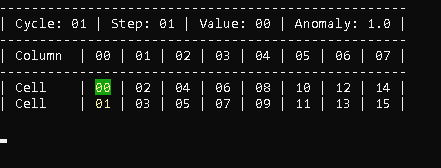

# htm.core C# REST examples

Some basic examples that show how to consume the [htm.core](https://github.com/htm-community/htm.core) [NetworkAPI REST Interface](https://github.com/htm-community/htm.core/blob/master/docs/NetworkAPI_REST.md) using C# and .NET Core 3.1.

## Pre-requisites

For the examples to work, you will need to have the [example REST server](https://github.com/htm-community/htm.core/tree/master/src/examples/rest) running that comes with [htm.core](https://github.com/htm-community/htm).

To get hold of the server, you can either

- download the source and [build](https://github.com/htm-community/htm.core/blob/master/README.md#building-from-source) it yourself. Once built, the server executable (rest_server) should be available in the build/Release/bin subdirectory of the htm.core project root folder.

or


- start a docker container using the [htm.core jupyter docker image](https://hub.docker.com/r/3rdman/htm.core-jupyter):
```docker run -d -p 8888:8888 -p 8050:8050 --name jupyter 3rdman/htm.core-jupyter:latest```

Per default, the server is listening on port 8050.

## Project structure

The project is divided up into two main areas/folders. Common and Examples.

### Common

This contains:

1) A very basic implementation of an SDR (utilizing [NumSharp](https://github.com/SciSharp/NumSharp)), along with some related tests.
2) The actual REST API client.
 
## The examples

There are currently two examples, which are located in the [Examples] directory.

### 1) SineWave

This example is inspired by the original htm.core [python REST client example](https://github.com/htm-community/htm.core/blob/master/py/htm/examples/rest/client.py) authored by David Keeney.

### 2) UpDownSequence

An adoption of the python script provided at the end of this [blog post](https://3rdman.de/2020/04/hierarchical-temporal-memory-part-2/), showing how the Temporal Memory learns a very simple sequence.



### Changing the example configurations

For both examples the configuration options are located in a separate file (ExampleConfiguration.cs). 
So if you want to play around with your own NetworkAPI settings, or adjust the URL to the NetworkAPI REST interface (default is http://localhost:8050/network), that's where to change it.

## Additional information

Please have a look at this [post](https://3rdman.de/2020/06/htm-core-and-csharp/).
